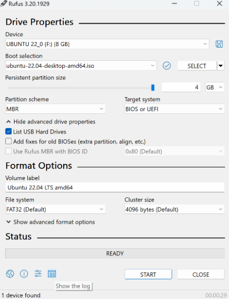
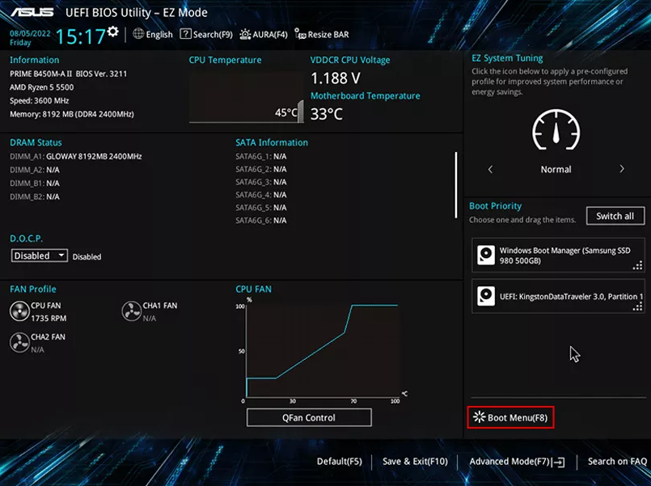
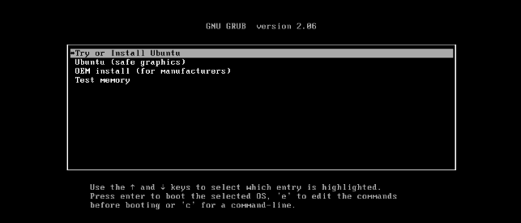
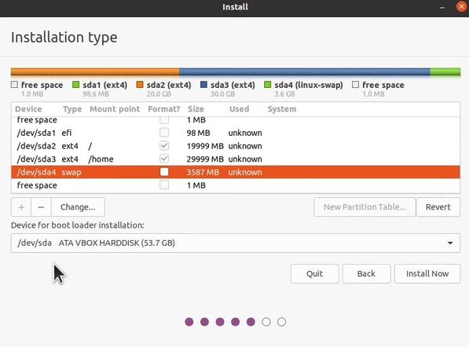
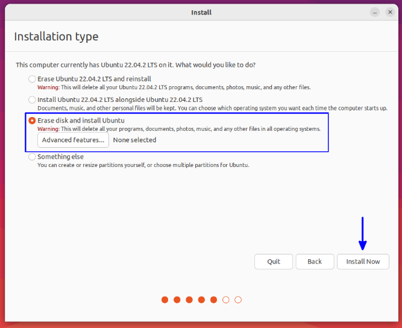
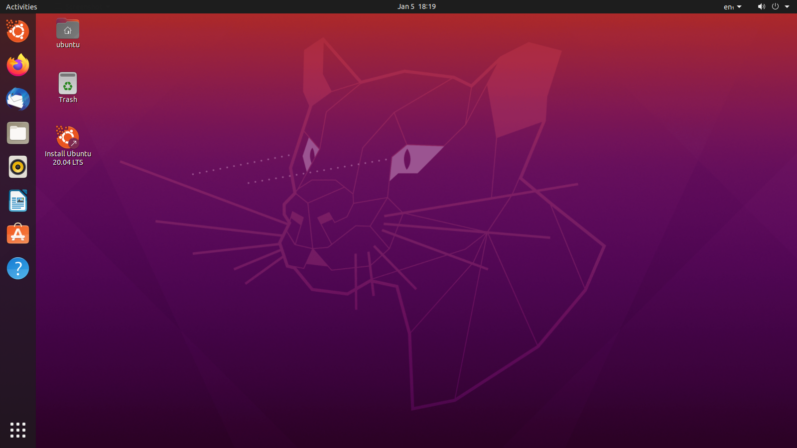

# Install Ubuntu desktop

Linux is completely free and there are many good distros out there. Among the distributions, Ubuntu is a specific implementation of Linux that includes a wide range of pre-installed software packages and tools that make it a complete operating system. One of the main advantages of using Ubuntu over other Linux distributions is its focus on ease of use and user-friendliness.


Let's start from installing a Ubuntu OS on your machine. The following step-by-step example will show how to use an `.iso` image to install the Ubuntu OS onto an actual physical hard disk. 

### Step1: Download the Ubuntu ISO file

Go to the official Ubuntu website and download the ISO file for the version of Ubuntu you want to install. One can download the image of Ubuntu 22.04 from:
- https://releases.ubuntu.com/22.04.2/ubuntu-22.04.2-desktop-amd64.iso

### Step2: Create a bootable USB drive

Creating a bootable USB drive is a useful way to install a new operating system. Insert a USB drive into your computer and use a tool like Rufus to create a bootable USB drive from the downloaded ISO file. There are a lot of different open-source bootable USB creation software available on the Internet. The following instruction provides you with a bootable USB drive that you can use to install Ubuntu on your computer.

1. Choose a USB drive with enough storage capacity.
2. Use you existing OS to download and install a bootable USB creation software. You can use software such as Rufus, UNetbootin or BalenaEtcher to create a bootable USB drive. Choose the software of compatible with your existing OS and download it.
3. In the bootable USB creation software, select the Ubuntu ISO file you just download.
4. Select the USB drive you want to use to create the bootable USB drive. Make sure to choose the correct USB drive, as all data on the drive will be erased.
5. Wait for the process to finish: The bootable USB creation software will guide you through the process, and the installation process would take a few minutes.
6. Eject the USB drive: Once the process is complete, eject the USB drive from the computer. Your bootable USB drive is now ready to use.



You can also refer to the following YouTube tutorial on how to install Ubuntu via USB in Windows 10
- https://www.youtube.com/watch?v=zHB1Eqj1xPk&t=131s

### Step3: Boot your computer from the USB drive

After gettign a bootable USB, insert the USB drive into your computer and restart it. During the boot process, access the boot menu or BIOS settings to set your USB drive as the first boot device. This will allow your computer to boot from the USB drive instead of the hard drive that contains your existing OS.



### Step4: Install Ubuntu on your machine  
Once your computer has booted from the USB drive, you will be presented with the Ubuntu installer. Follow the on-screen instructions to select your language, time zone, keyboard layout, and disk partitioning options. You will also be prompted to create a username and password. 



#### Disk Partition
One of the most important step during the installation process could be the disk partiioning. In the Linux system, every device is treated as a file. For example, the file name for a hard disk with a SATA interface is `/dev/sd[a-d]`, where the letter inside the brackets can be any of a, b, c, or d. 



> Note: When managing your disk partition, please confirm that the hard disk you choose is new or you no longer need the data on that hard disk. This is because Linux will automatically delete all the existing data on it during the installation.


You can simply adopt the default partioning setting to install Ubuntu. However, with manual partition settings (click the "Advanced features" as the following figure shows), you will have more control over the partitioning of your hard drive. For instance, if you plan on running multiple operating systems on your computer, manual partition settings can be very helpful. You can create separate partitions for each operating system and easily switch between them. 



A more advanced option is to first analyze the future use of this host, and then based on that, analyze which directories will need larger capacity and which ones will be read and written to frequently. These important directories should be separated from the root directory and placed in their own partition. When these partitions that are read and written to frequently have problems, it will not affect the system data in the root directory, making it easier to recover. 


To create a new partition we can click the "+" button on on the Ubuntu installer page. Choose the size and type of partition you want to create (e.g., `Primary` or `Logical`), and select the mount point for the partition (e.g., `/`, `/home`, or `/boot`). Following is an example that creates five partitions on the /dev/sda disk: a 500 MB partition for `/boot`, a 100 GB partition for the root file system (`/`), a 800 GB partition for the `/home` directory, a 50 GB partition for the `/var` directory, and an 8 GB swap partition.

 
```sh
Device          Type    Mount Point    Size
/dev/sda        ATA     <disk label>   1 TB
  /dev/sda1     Ext4    /boot          500 MB
  /dev/sda2     Ext4    /              100 GB
  /dev/sda3     Ext4    /home          800 GB
  /dev/sda4     Ext4    /var           50 GB
  /dev/sda5     Swap                   8 GB
```


After setting and confirming all the configurations, the Ubuntu installer will start installing the OS into your hard disk, which could take a few minutes to finish. Once the process finishes, you will be asked to restart the system, and then you should see the Ubuntu GUI showing up on your screen, which means you've install your Ubuntu sucessfully. 



It's also possible to change your disk partion setting after installation, but it could be more tricky and complicated. See the following tutorial if you are interested in:
- https://www.psychocats.net/ubuntu/separatehome


### Summary
In this chapter, we have introduced how to install Ubuntu on your machine by creating a bootable USB. Manual disk partitioning can be confusing for new Linux users, but it provides several advantages such as increasing system's safety and robustness. For more details and recommendations about disk partition, one can refer to:
- https://averagelinuxuser.com/linux-partitioning-recommendations/
-https://askubuntu.com/questions/21719/how-large-should-i-make-root-home-and-swap-partitions

