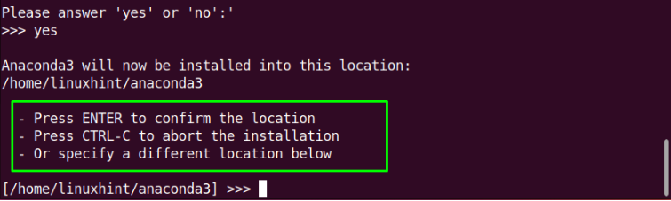
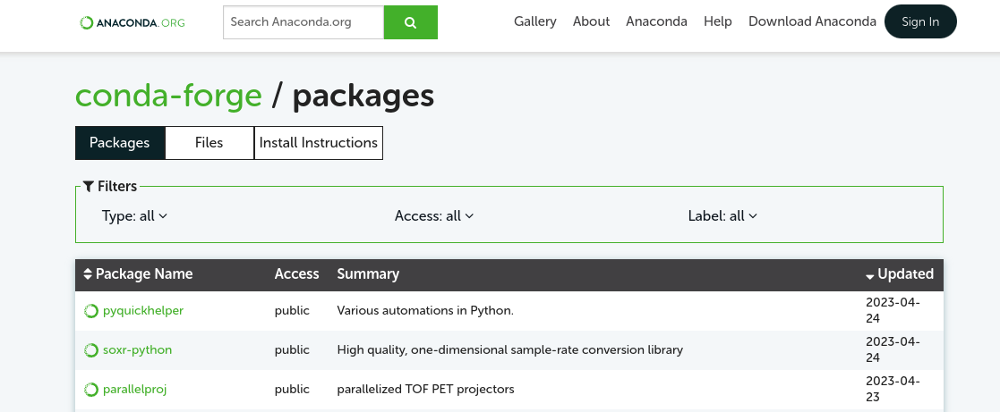

# Virtual Enviornment

A virtual environment in Linux is a self-contained directory tree that contains a specific version of the necessary packages and dependencies required by a particular project. It allows you to have multiple projects with different dependencies on the same system without any conflicts by providing a clean and consistent environment for your code to run, regardless of the underlying system configuration. For instance, if you have two applications and each of them require a different python version, you can run both applications on your machine by running them in separate virtual environemnts.

Virtual environments are commonly used in Python programming to create an isolated environment for a specific project, where you can install, upgrade, and remove Python packages and dependencies without affecting other Python projects on the same system. Creating a virtual environment involves creating a new directory and installing a specific version of Python into it. Then, you can activate the virtual environment and install any necessary Python packages and dependencies for your project.

### Install Anaconda
Here, we choose Anaconda as our example. Anaconda provides a complete and flexible development environment for Python and R developers, with features like package management, virtual environments, and integrated development environments (IDEs) like Jupyter Notebook and Spyder.

#### To install Anaconda on a Linux system:

1. Download the Anaconda installer: Go to the Anaconda website (https://www.anaconda.com/products/individual) and download the installer for Linux.


2. Open a terminal and navigate to the directory where the Anaconda installer was downloaded. Run the installer by typing the following command:
```sh
bash Anaconda<version>-Linux-x86_64.sh
```

3. Follow the on-screen instructions to complete the installation process. You will be prompted to agree to the license terms and choose the installation location. Specify the directory location where you want to save the files related to the Anaconda installation 



4. After the installation is complete, open a new terminal and run the following command to verify installation:
```sh
conda --version
```

Some of you might encounter a "Conda command not found" error when doing step 4, even though you should have installed Anaconda successfully. This is probably because Anaconda has not been set up to your `.bashrc` (recall that we say the system will launch `.bashrc` whenever you open a terminal in Chapter3). To solve it, you need to add this line to your `.bashrc`:

```sh
export PATH="/home/username/Anacondabin:$PATH"
```
Make sure to replace `/home/username/Anaconda` with your actual Anaconda directory location specified in step3. For more details, one can follow the insturctions the issue in:
- https://linuxhint.com/install-anaconda-ubuntu-22-04/
- https://stackoverflow.com/questions/35246386/conda-command-not-found


### Manipulate an environement
After successfully installing Anaconda, now we can create an environment using:
```sh
conda create -n myenv python=3.9
```
The above example will create an environment called "myenv" with a specific python version. Some open source code would provide you with a `environment.yml` file, which wraps all the required packages up for you. In that case, you can create the same environment on your machine by:
```sh
conda env create -f environment.yml
```
Sometimes you may want to clone an old environment and then delete or add packages to it, try:
```sh
conda create -n newenv --clone oldenv
```
To see what conda environments you have installed, one can use the following command:
```sh
conda env list
```
To install packages in yoru current conda environment:
```sh
conda install python=3.7 codecov
```
> Note: You can search the packages as well as the commands to install them on https://anaconda.org/conda-forge/repo.



To remove and environment or a package in the environment:
```sh
# Remove a package
conda remove --name myenv numpy
# Remove an environment
conda env remove -n myenv
```

Finally, to active an environment and then run you applicaiona in it:
```sh
conda activate myenv
python app.py
```

### Summary
In this chapter, we show how to install and use a virtual environment to provide an isolated environment where you can install packages and dependencies specific to your project. This helps to avoid conflicts between different projects and increase reproducibility. Furthermore, conda virtual environments are cross-platform, which means that you can create an environment on one platform (e.g., Windows) and use it on another (e.g., Linux). This makes it easy to develop and test applications on multiple platforms.


