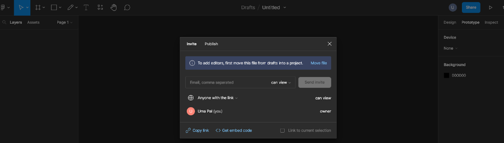

# AppSheet & Figma Tutorial 

## Appsheet

You will need a Google/Gmail account to use Appsheet, you should be able to use your Umass gmail account. 

#### Step 1: 
Go to appsheet at https://www.appsheet.com and sign in with your Google account. Click on the “Create” button in the top left hand corner and select the type of app you want to create. You can use data you have already collected, or start with a template to create your app.

There are many app templates available that you might find useful as a starting point such as simple survey forms, class attendance, task managers etc.:

#### Step 2: 
Connect your data (Your data can come from your observations stage). Appsheet supports databases, Google Sheets, and Excel spreadsheets. Once you are in your app, go to the Data tab on the top left and select “Add data source.” Select the type of data source you want to connect to and follow the instructions. 

#### Step 3: 
Design your app (you have been in the process of doing this through the Milestones). AppSheet allows you to drag and drop features like buttons, forms and other UI elements you might want. 
 
#### Step 4: 
Test your app. Click on the “Test” button in the top right hand corner to open a preview of your app, which you can use to test its functionality. 

#### Step 5: 
Deploy your app. Once you’re finished making your app, you can click “Deploy” in the top right hand corner. This will create a URL to your app that you can share with others. You can also publish your app to the App Store or Google Play if you want. 

Here are some specific examples of making apps with AppSheet: 
- https://youtu.be/qJrh1uaqN5g
- https://youtu.be/1E1jpud__Ds
- https://youtu.be/mVC1riIS-hg

## Figma
#### Step 1: 
Make a Figma account & sign in to Figma, once you do (assuming this is your first time using it), the site will take you through a short tutorial of all its main features. 

#### Step 2: 
Create a new file by clicking the “New design file” button.

#### Step 3: 
Design your screens. Once you have opened your new design file, you will see a sketchpad where you can add textboxes, shapes, and draw any designs you need for your app, using the buttons on the top left hand panel. 

#### Step 4: 
Add interactivity (animations, buttons, etc.). Once you have created your app screen, you can click on the “Prototype” button on the menu to the left side and click components of your app that need to be interactive, and where they will be after an interaction. Once you have bound an interaction to your components, you can use the Interaction Details panel to customize it. This is essentially like creating PowerPoint animations that represent how your app should work (i.e. what happens when you click a button). More details are here: https://help.figma.com/hc/en-us/articles/360040315773-Prototype-interactions-and-animations#Create_an_interaction

#### Step 5: 
Test your prototype. Click on the “Prototype” button on the right hand panel, and click on the “Present” button in the right hand corner (it looks like a play button). Now you can preview your app as a prototype, and click on your interactive elements and test the apps functionality. Use the esc key to exit presentation mode and return to your Figma editor. 

#### Step 6: 
Share your prototype. Click on the “Prototype” button on the right hand panel, and click on the “Share” button in the right hand corner next to the “Present” button. Once you decide your sharing settings, this will generate a link to your app. This is pretty much the same mechanism as sharing Google docs with each other with links. 

More useful tutorials/resources: 
- https://youtu.be/L22lDu3QX2c
- https://youtu.be/FTFaQWZBqQ8

