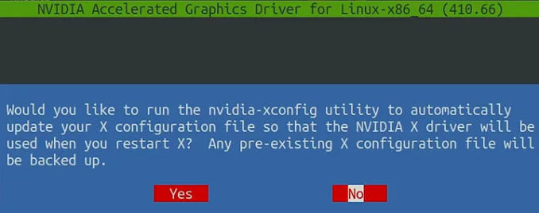
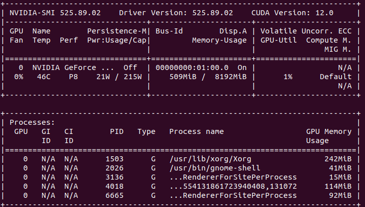

# Set up an environment for GPU-driven applications

Nowadays, GPU and deep learning techniques are essential for a wide range of applications that require computationally intensive tasks. Some of the most common applications that rely on GPU and deep learning techniques include:
- **Computer Vision**: Applications that require image and video analysis, such as object detection, recognition, and tracking.
- **Natural Language Processing**: Deep learning techniques are also used for natural language processing applications such as speech recognition, machine translation, and sentiment analysis. These applications rely on neural networks to analyze and understand natural language data.
- **Robotics**: Robotics applications require real-time decision making, which can be achieved through deep learning techniques. For instance, robotic control systems and autonomous drones rely on deep learning algorithms to process sensor data and make decisions in real-time.
- **Gaming**: Modern video games require high-performance graphics rendering, which can be achieved through the use of GPUs. Deep learning techniques can also be used for game AI, enabling NPCs (non-player characters) to make more sophisticated decisions and interact with players in a more natural way.


#### Set up your environment for GPU-driven applications
In this tutorial, we will learn how to install NVIDIA driver and CUDA on **Ubuntu 20.04**. We need NVIDIA driver and CUDA for GPU-driven applications because these applications require access to the specialized computing capabilities of the GPU. The GPU has a massive number of parallel processing cores, making it well-suited for computationally-intensive tasks that require massive parallelization. By using the NVIDIA driver and CUDA, developers can leverage the GPU's power to accelerate the performance of their applications significantly. Without these components, applications would not be able to access the GPU's capabilities and would be limited to the performance of the CPU alone.


## 1. Install NVIDIA Driver
NVIDIA driver is a software component that allows communication between the operating system and NVIDIA GPU hardware. The driver provides access to the GPU's computing power, enabling applications to use the GPU for computation, graphics rendering, and other specialized tasks. 

#### Step 1
Download the Official Nvidia Driver.Using your web browser navigate to the official Nvidia website and download an appropriate driver for your Nvidia graphic card.


#### Step 2
Install Prerequisites. The following prerequisites are required to compile and install Nvidia driver:
```sh
sudo apt install build-essential libglvnd-dev pkg-config
```

#### Step 4
Disable the default nouveau Nvidia driver. This step is essential to prevent potential confliction between the Nvidia driver and the default driver in Ubuntu.
```sh
# Blacklist Nvidia nouveau driver
$ sudo bash -c "echo blacklist nouveau > /etc/modprobe.d/blacklist-nvidia-nouveau.conf"
$ sudo bash -c "echo options nouveau modeset=0 >> /etc/modprobe.d/blacklist-nvidia-nouveau.conf"

# Confirm the content of the newly created modeprobe file blacklist-nvidia-nouveau.conf
$ cat /etc/modprobe.d/blacklist-nvidia-nouveau.conf

# Update kernel initramfs
$ sudo update-initramfs -u

# Reboot your system
$ sudo reboot
```

#### Step 5
In order to install new Nvidia driver we need to stop the current display server. Turn off your graphical desktop by:
```sh
$ sudo telinit 3
```

#### Step 6
Go the the directory where you downloaded the driver .run file. Execute the file and follow the wizard.
```sh
$ chmod u+x NVIDIA-Linux-x86_64-440.44.run
$ sudo ./NVIDIA-Linux-x86_64-440.44.run
```




#### Step 7 
Reboot your system. And check if the Nvidia driver is now installed by:
```sh
$ nvidia-smi
```
If it works, you will something like this showing on your terminal:


Congrats! You have successfully install Nvidia Driver on your machine. There are different ways to install the driver. Take a look at the following tutorial for more details:
- https://linuxconfig.org/how-to-install-the-nvidia-drivers-on-ubuntu-20-04-focal-fossa-linux


## 2. Install CUDA Software
CUDA (Compute Unified Device Architecture) is a parallel computing platform and programming model developed by NVIDIA. CUDA enables developers to utilize the computing power of NVIDIA GPUs for general-purpose computing, not just graphics processing. CUDA provides an interface for developers to write parallel code that can run on NVIDIA GPUs, which can significantly accelerate the performance of many applications.

#### Step 1
Download the CUDA installer runfile. The NVIDIA CUDA Toolkit is available at:
- https://developer.nvidia.com/cuda-downloads


#### Step 2
Install the CUDA Software:
```sh
$ sudo chmod +x cuda_{version_of_your_cuda}_linux.run
$ sudo ./cuda_{version_of_your_cuda}_linux.run
$ reboot
```


#### Step 3
After rebooting your desktop, activate the CUDA library by:
```sh
# Check the cuda libraries you have
ls /usr/local/cuda
# Export the cuda that you've chosen
export LD_LIBRARY_PATH=$LD_LIBRARY_PATH:/usr/local/cuda/lib64
export PATH=/usr/local/cuda-{version_of_your_cuda}/bin:$PATH
export CUDA_HOME=$CUDA_HOME:/usr/local/cuda
```

#### Step 4
To check if the your CUDA has been successfully installed, run:
```sh
nvcc --version
```

If you see something like this on your terminal. Congrats! The CUDA have been successfully installed.

#### Appendix
If you would like to change your cuda to other cuda versions that you've downloaded and installed before:
```sh
# Remove the old cuda directory
$ sudo rm -r /usr/local/cuda
# Create a new soft link of the target cuda version
$ sudo ln -s /usr/local/cuda-11.7 /usr/local/cuda
```

Other useful tutorials:
- https://medium.com/geekculture/install-cuda-and-cudnn-on-windows-linux-52d1501a8805


## 3. Python's Virtual Environment
Python's virtual environment provides several advantages when running deep learning applications:

- **Isolation**: A virtual environment creates an isolated environment with its own set of dependencies, which can prevent conflicts between different versions of packages and libraries required by different projects. In other words, you can have different virtual environments for different deep learning projects, each with its own set of dependencies, without worrying about version conflicts.

- **Reproducibility**: With a virtual environment, you can easily reproduce the environment on another machine or share it with your colleagues. This ensures that everyone is using the same version of libraries and packages, and reduces the chances of compatibility issues or unexpected behavior.

- **Dependency management**: Managing dependencies can be challenging, especially for large deep learning projects with many packages and libraries. A virtual environment makes it easier to manage dependencies by isolating them and allowing you to install, upgrade, or remove them without affecting the system-wide installation of these packages and libraries.

- **Performance**: Deep learning applications require significant computing power, and running them on a virtual environment can improve performance by reducing the overhead of system-wide package installations.

#### Install Anaconda on a Linux system:

1. Download the Anaconda installer: Go to the Anaconda website (https://www.anaconda.com/products/individual) and download the installer for Linux.


2. Open a terminal and navigate to the directory where the Anaconda installer was downloaded. Run the installer by typing the following command:
```sh
bash Anaconda<version>-Linux-x86_64.sh
```

3. Follow the on-screen instructions to complete the installation process. You will be prompted to agree to the license terms and choose the installation location. Specify the directory location where you want to save the files related to the Anaconda installation 


4. After the installation is complete, open a new terminal and run the following command to verify installation:
```sh
conda --version
```

Some of you might encounter a "Conda command not found" error when doing step 4, even though you should have installed Anaconda successfully. This is probably because Anaconda has not been set up to your `.bashrc` (recall that we say the system will launch `.bashrc` whenever you open a terminal in Chapter3). To solve it, you need to add this line to your `.bashrc`:

```sh
export PATH="/home/username/Anacondabin:$PATH"
```
Make sure to replace `/home/username/Anaconda` with your actual Anaconda directory location specified in step3. For more details, one can follow the insturctions the issue in:
- https://linuxhint.com/install-anaconda-ubuntu-22-04/
- https://stackoverflow.com/questions/35246386/conda-command-not-found


#### Manipulate an environement
After successfully installing Anaconda, now we can create an environment using:
```sh
conda create -n myenv python=3.9
```
The above example will create an environment called "myenv" with a specific python version. Some open source code would provide you with a `environment.yml` file, which wraps all the required packages up for you. In that case, you can create the same environment on your machine by:
```sh
conda env create -f environment.yml
```
Sometimes you may want to clone an old environment and then delete or add packages to it, try:
```sh
conda create -n newenv --clone oldenv
```
To see what conda environments you have installed, one can use the following command:
```sh
conda env list
```
To install packages in yoru current conda environment:
```sh
conda install python=3.7 codecov
```
> Note: You can search the packages as well as the commands to install them on https://anaconda.org/conda-forge/repo.


To remove and environment or a package in the environment:
```sh
# Remove a package
conda remove --name myenv numpy
# Remove an environment
conda env remove -n myenv
```

Finally, to active an environment and then run you applicaiona in it:
```sh
conda activate myenv
python app.py
```

### Summary
If you successfully finish all the content in this tutorial. Congratulation! Now you should be able to run many open-source GPU-driven applications on your Ubuntu 20.04. In this chapter, we saw how to install the NVIDIA drivers and CUDA on Ubuntu 20.04. There are several methods used for this process. For more details, please refer to the official CUDA installation guide:
- https://docs.nvidia.com/cuda/cuda-installation-guide-microsoft-windows/

Also, we show how to install Nvidia driver and and use a virtual environment to provide an isolated environment where you can install packages and dependencies specific to your project. This helps to avoid conflicts between different projects and increase reproducibility. Furthermore, conda virtual environments are cross-platform, which means that you can create an environment on one platform (e.g., Windows) and use it on another (e.g., Linux). This makes it easy to develop and test applications on multiple platforms.


